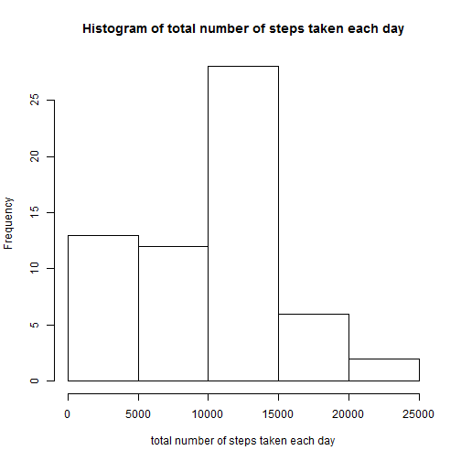
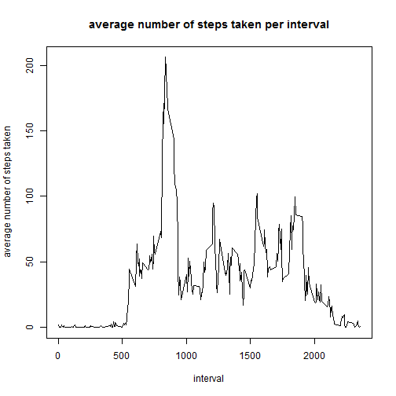
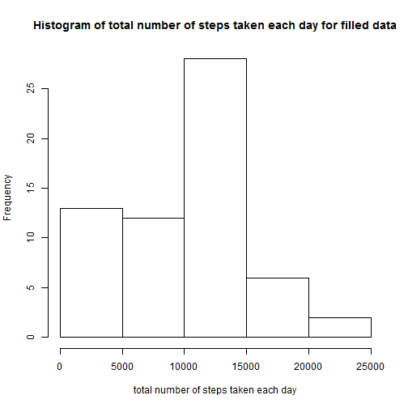
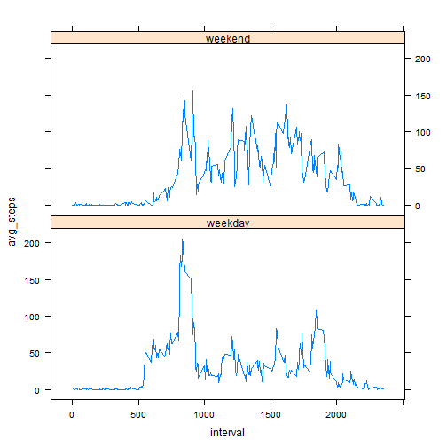

## Loading and preprocessing the data
Load the libraries required for study.

```r
library(lubridate)
library(plyr)
library(dplyr)
library(lattice)
```

Read activity data into a data frame.

```r
zip <- "activity.zip"
file <- "activity.csv"
rawdata <- read.csv(unz(zip, file),colClasses=c("integer", "POSIXct", "integer"))
head(rawdata)
```

```
##   steps       date interval
## 1    NA 2012-10-01        0
## 2    NA 2012-10-01        5
## 3    NA 2012-10-01       10
## 4    NA 2012-10-01       15
## 5    NA 2012-10-01       20
## 6    NA 2012-10-01       25
```


## What is mean total number of steps taken per day?
Missing data are ignored for calculations.

```r
stepsPerDay <- tapply(rawdata$steps,rawdata$date,sum, na.rm = TRUE)
hist(stepsPerDay, main="Histogram of total number of steps taken each day",
                  xlab="total number of steps taken each day")
```

 

Mean number of steps taken each day is:

```r
mean(stepsPerDay, na.rm=TRUE)
```

```
## [1] 9354.23
```

Median number of steps taken each day is:

```r
median(stepsPerDay, na.rm=TRUE)
```

```
## [1] 10395
```

## What is the average daily activity pattern?

```r
stepsPerInterval <- rawdata %>% 
                        group_by(interval) %>%
                        summarise(avg_steps=mean(steps, na.rm=TRUE))
with(stepsPerInterval, 
     plot(interval , avg_steps, type="l", 
              ylab="average number of steps taken",
              main="average number of steps taken per interval"))
```

 

The interval containing maximum number of steps on average is:

```r
with(stepsPerInterval, interval[which.max(avg_steps)])
```

```
## [1] 835
```


## Imputing missing values?
Number of rows with missing data is:

```r
sum(!complete.cases(rawdata))
```

```
## [1] 2304
```

Missing data is imputed using median value over that interval. THe imputed result is stored in dataset filledData.


```r
impute_step = function(data) {
  medianStepsPerInterval <- tapply(data$steps,data$interval,median, na.rm = TRUE)
  ifelse(is.na(data$steps), medianStepsPerInterval[as.character(data$interval)], data$steps)
}

filledData <- data.frame(steps = impute_step(rawdata), date = rawdata$date, interval = rawdata$interval)
head(filledData)
```

```
##   steps       date interval
## 1     0 2012-10-01        0
## 2     0 2012-10-01        5
## 3     0 2012-10-01       10
## 4     0 2012-10-01       15
## 5     0 2012-10-01       20
## 6     0 2012-10-01       25
```

Total steps taken per day with filled data.

```r
processedStepsPerDay <- tapply(filledData$steps,filledData$date,sum, na.rm = TRUE)
hist(processedStepsPerDay,
        main="Histogram of total number of steps taken each day for filled data",
        xlab="total number of steps taken each day")
```

 

Mean steps taken per day with filled data is:

```r
mean(processedStepsPerDay, na.rm=TRUE)
```

```
## [1] 9503.869
```

Median steps taken per day with filled data is:

```r
median(processedStepsPerDay, na.rm=TRUE)
```

```
## [1] 10395
```


## Are there differences in activity patterns between weekdays and weekends?

```r
filledData$day <- factor(ifelse(wday(filledData$date) %in% c(1,7),"weekend", "weekday"))
x <- ddply(filledData, .(day, interval), summarise, avg_steps=mean(steps))
xyplot(avg_steps ~ interval | day, type="l", data=x, layout = c(1,2))
```

 
